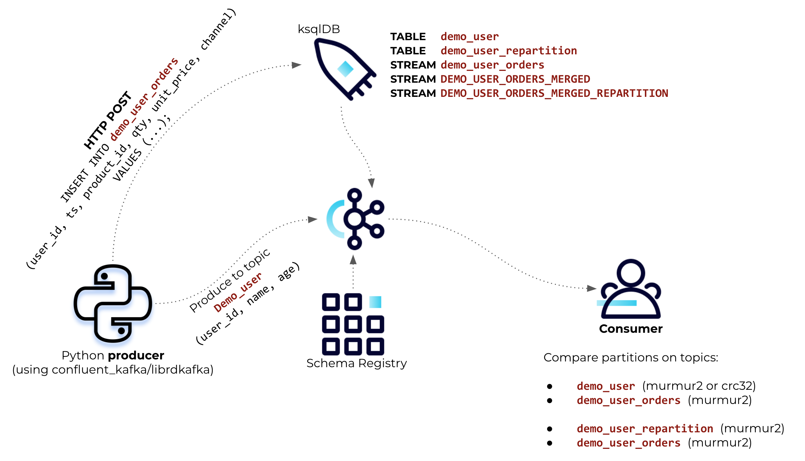

# python_partitioner_murmur2
There is no common partitioner for all Apache Kafka resources/libs/clients. For example all producers using librdkafka by default uses `crc32` (such as Python’s confluent_kafka), whilst JAVA ones uses `murmur2_random` (Kafka Streams, ksqlDB, Source Connectors, etc.).
> The default partitioner in Java producer uses the murmur2 hash function while the default partitioner in librdkafka uses crc32. Because of the different hash functions, a message produced by a Java client and a message produced by a librdkafka client may be assigned to different partitions even with the same partition key (source: https://docs.confluent.io/kafka-clients/librdkafka/current/overview.html#synchronous-writes).

So, if a producer using python (confluent_kafka lib, for example) and Source Connector (Java) are producing data to Kafka, then very likely a merge on ksqlDB would not work properly as there would be a partition mismatch.<br><br>
The python script on this demo can use either crc32 or murmu2_random as the partitioner. It will produce messages both to the topic `{topic}` (as set when running the python script) as well as to a ksqlDB stream and have it stored on the topic `{topic}-ksql`.

## Demo diagram


## Installation and Configuration
- Docker Desktop and Python +3.8 required
- Install python virtual environment: `python3 -m pip install venv`
- Clone this repo: `git clone git@github.com:ifnesi/python_partitioner_murmur2.git`
- Go to the folder where the repo was cloned: `cd python_partitioner_murmur2`
- Create a virtual environment: `python3 -m venv _venv`
- Activate the virtual environment: `source _venv/bin/activate`
- Install project requirements: `python3 -m pip install -f requirements.txt`
- Deactivate the virtual environment: `deactivate`

## Python script usage
```
usage: producer.py [-h]
                   [--topic TOPIC]
                   [--partitions PARTITIONS]
                   [--messages MESSAGES]
                   [--client_id CLIENT_ID]
                   [--crc32]
                   [--bootstrap_server BOOTSTRAP_SERVER]
                   [--ksqldb_endpoint KSQLDB_ENDPOINT]
                   [--debug]

Produce messages using murmur2_random as the partitioner

options:
  -h, --help            show this help message and exit
  --topic TOPIC         Topic name (default 'demo_user')
  --partitions PARTITIONS
                        Number of partitions to be set when creating the topic (default is 6)
  --messages MESSAGES   Number of messages to be produced (default is 10)
  --client_id CLIENT_ID
                        Producer Client ID (default is your hostname)
  --crc32               Set librdkafka's default partitioner (crc32), otherwise it will be used murmur2_random
  --bootstrap_server BOOTSTRAP_SERVER
                        Bootstrap servers (default is 'localhost:9092')
  --ksqldb_endpoint KSQLDB_ENDPOINT
                        ksqlDB endpoint (default is 'http://localhost:8088')
  --debug               Set logging level to debug
```

## Running the demo
- Activate the virtual environment: `source _venv/bin/activate`
- Start up docker compose: `docker-compose up -d`
- Waiting until you can access C3: `http://127.0.0.1:9021/` and the ksqlDB cluster is up: `http://127.0.0.1:8088/`
- Running python script (using murmur2_random partitioner): `python3 producer.py --messages 10 --debug`
```
INFO 23:49:47.745 - Validating access to ksqlDB: http://localhost:8088...
DEBUG 23:49:47.751 - Starting new HTTP connection (1): localhost:8088
DEBUG 23:49:47.755 - http://localhost:8088 "GET / HTTP/1.1" 307 0
DEBUG 23:49:47.758 - http://localhost:8088 "GET /info HTTP/1.1" 200 132

INFO 23:49:47.764 - Creating topics: demo_user and demo_user_orders...

INFO 23:49:47.771 - Creating ksqlDB Stream: demo_user_orders...
DEBUG 23:49:47.772 - Starting new HTTP connection (1): localhost:8088
DEBUG 23:49:47.818 - http://localhost:8088 "POST /ksql HTTP/1.1" 200 381
DEBUG 23:49:47.818 - ksqlDB (200): CREATE STREAM IF NOT EXISTS demo_user_orders ( user_id VARCHAR KEY, ts BIGINT, product_id BIGINT, qty BIGINT, unit_price DOUBLE, channel VARCHAR ) WITH ( kafka_topic='demo_user_orders', VALUE_FORMAT='JSON', timestamp = 'ts' );

INFO 23:49:47.818 - Creating ksqlDB Table: demo_user...
DEBUG 23:49:47.819 - Starting new HTTP connection (1): localhost:8088
DEBUG 23:49:47.848 - http://localhost:8088 "POST /ksql HTTP/1.1" 200 295
DEBUG 23:49:47.848 - ksqlDB (200): CREATE TABLE IF NOT EXISTS demo_user ( user_id VARCHAR PRIMARY KEY, name VARCHAR, age BIGINT ) WITH ( kafka_topic='demo_user', VALUE_FORMAT='JSON' );

INFO 23:49:47.848 - Creating ksqlDB Stream: demo_user_orders_merged...
DEBUG 23:49:47.849 - Starting new HTTP connection (1): localhost:8088
DEBUG 23:49:47.989 - http://localhost:8088 "POST /ksql HTTP/1.1" 200 436
DEBUG 23:49:47.989 - ksqlDB (200): CREATE STREAM IF NOT EXISTS demo_user_orders_merged AS SELECT DEMO_USER_ORDERS.user_id AS user_id, DEMO_USER.name, DEMO_USER.age, product_id, qty, unit_price, channel, ts FROM DEMO_USER_ORDERS LEFT JOIN DEMO_USER ON DEMO_USER_ORDERS.user_id = DEMO_USER.user_id EMIT CHANGES;

INFO 23:49:47.991 - Producing messages to topics: demo_user and demo_user_orders...
DEBUG 23:49:47.992 - Starting new HTTP connection (1): localhost:8088
DEBUG 23:49:48.022 - http://localhost:8088 "POST /ksql HTTP/1.1" 200 2
DEBUG 23:49:48.022 - ksqlDB (200): INSERT INTO demo_user_orders ( user_id, ts, product_id, qty, unit_price, channel ) VALUES ( 'ef51cd94159f16138645cd8c29a655f9', 1677800987991, 1780, 10, 36.6, 'partner' );
DEBUG 23:49:48.022 - Message 'ef51cd94159f16138645cd8c29a655f9 | {"name": "Konner Evans", "age": 59}' delivered to topic 'demo_user', partition #1, offset #10
DEBUG 23:49:48.023 - Starting new HTTP connection (1): localhost:8088
DEBUG 23:49:48.051 - http://localhost:8088 "POST /ksql HTTP/1.1" 200 2
DEBUG 23:49:48.052 - ksqlDB (200): INSERT INTO demo_user_orders ( user_id, ts, product_id, qty, unit_price, channel ) VALUES ( '1d8aaf0f8d5120d1b05cfb0cdbcb133c', 1677800988022, 1098, 9, 30.2, 'catalog' );
DEBUG 23:49:48.052 - Message '1d8aaf0f8d5120d1b05cfb0cdbcb133c | {"name": "Steven Black", "age": 54}' delivered to topic 'demo_user', partition #0, offset #8
DEBUG 23:49:48.053 - Starting new HTTP connection (1): localhost:8088
DEBUG 23:49:48.080 - http://localhost:8088 "POST /ksql HTTP/1.1" 200 2
DEBUG 23:49:48.080 - ksqlDB (200): INSERT INTO demo_user_orders ( user_id, ts, product_id, qty, unit_price, channel ) VALUES ( '623cee3cebfe00b782a4d11564478f46', 1677800988052, 1549, 2, 12.51, 'partner' );
DEBUG 23:49:48.080 - Message '623cee3cebfe00b782a4d11564478f46 | {"name": "Skye Barry", "age": 52}' delivered to topic 'demo_user', partition #0, offset #9
DEBUG 23:49:48.081 - Starting new HTTP connection (1): localhost:8088
DEBUG 23:49:48.107 - http://localhost:8088 "POST /ksql HTTP/1.1" 200 2
DEBUG 23:49:48.108 - ksqlDB (200): INSERT INTO demo_user_orders ( user_id, ts, product_id, qty, unit_price, channel ) VALUES ( '74948eefa67d252cb0536291ff1db489', 1677800988080, 1248, 10, 78.44, 'web' );
DEBUG 23:49:48.108 - Message '74948eefa67d252cb0536291ff1db489 | {"name": "Derick Washington", "age": 59}' delivered to topic 'demo_user', partition #3, offset #7
DEBUG 23:49:48.109 - Starting new HTTP connection (1): localhost:8088
DEBUG 23:49:48.137 - http://localhost:8088 "POST /ksql HTTP/1.1" 200 2
DEBUG 23:49:48.137 - ksqlDB (200): INSERT INTO demo_user_orders ( user_id, ts, product_id, qty, unit_price, channel ) VALUES ( '2bde78caeae7c837b8dc66d5ea33efd3', 1677800988108, 1197, 7, 45.82, 'web' );
DEBUG 23:49:48.137 - Message '2bde78caeae7c837b8dc66d5ea33efd3 | {"name": "Eric Blake", "age": 43}' delivered to topic 'demo_user', partition #1, offset #11
DEBUG 23:49:48.138 - Starting new HTTP connection (1): localhost:8088
DEBUG 23:49:48.164 - http://localhost:8088 "POST /ksql HTTP/1.1" 200 2
DEBUG 23:49:48.164 - ksqlDB (200): INSERT INTO demo_user_orders ( user_id, ts, product_id, qty, unit_price, channel ) VALUES ( 'ac1faa9d3867bd9bd5bd3a124b33b636', 1677800988137, 1498, 2, 93.23, 'partner' );
DEBUG 23:49:48.165 - Message 'ac1faa9d3867bd9bd5bd3a124b33b636 | {"name": "Dion Hunter", "age": 50}' delivered to topic 'demo_user', partition #0, offset #10
DEBUG 23:49:48.166 - Starting new HTTP connection (1): localhost:8088
DEBUG 23:49:48.195 - http://localhost:8088 "POST /ksql HTTP/1.1" 200 2
DEBUG 23:49:48.195 - ksqlDB (200): INSERT INTO demo_user_orders ( user_id, ts, product_id, qty, unit_price, channel ) VALUES ( '3c1c15eb8d0855d12efb13093a7126c5', 1677800988165, 1487, 6, 39.52, 'catalog' );
DEBUG 23:49:48.195 - Message '3c1c15eb8d0855d12efb13093a7126c5 | {"name": "Clark Serrano", "age": 39}' delivered to topic 'demo_user', partition #2, offset #6
DEBUG 23:49:48.197 - Starting new HTTP connection (1): localhost:8088
DEBUG 23:49:48.223 - http://localhost:8088 "POST /ksql HTTP/1.1" 200 2
DEBUG 23:49:48.223 - ksqlDB (200): INSERT INTO demo_user_orders ( user_id, ts, product_id, qty, unit_price, channel ) VALUES ( 'a386caaac46f359205c66b5f3586e5a5', 1677800988196, 1492, 5, 8.77, 'web' );
DEBUG 23:49:48.223 - Message 'a386caaac46f359205c66b5f3586e5a5 | {"name": "Jayda Villanueva", "age": 29}' delivered to topic 'demo_user', partition #2, offset #7
DEBUG 23:49:48.225 - Starting new HTTP connection (1): localhost:8088
DEBUG 23:49:48.256 - http://localhost:8088 "POST /ksql HTTP/1.1" 200 2
DEBUG 23:49:48.259 - ksqlDB (200): INSERT INTO demo_user_orders ( user_id, ts, product_id, qty, unit_price, channel ) VALUES ( 'd4d727bc04aab7e647efd29e2dda2083', 1677800988223, 1734, 10, 0.89, 'web' );
DEBUG 23:49:48.259 - Message 'd4d727bc04aab7e647efd29e2dda2083 | {"name": "Navy Lim", "age": 59}' delivered to topic 'demo_user', partition #1, offset #12
DEBUG 23:49:48.261 - Starting new HTTP connection (1): localhost:8088
DEBUG 23:49:48.288 - http://localhost:8088 "POST /ksql HTTP/1.1" 200 2
DEBUG 23:49:48.289 - ksqlDB (200): INSERT INTO demo_user_orders ( user_id, ts, product_id, qty, unit_price, channel ) VALUES ( '676691410eeb10527efe4fa5bf5a1a2c', 1677800988260, 1587, 8, 15.46, 'catalog' );
DEBUG 23:49:48.289 - Message '676691410eeb10527efe4fa5bf5a1a2c | {"name": "Nyomi Lowery", "age": 64}' delivered to topic 'demo_user', partition #3, offset #8

INFO 23:49:48.289 - Comparing partitions between producer and ksqlDB stream...
INFO 23:49:53.339 - Matched partitions: 100.00%

INFO 23:49:53.339 - Push query results on Stream/Table join...
                         USER_ID              NAME AGE PRODUCT_ID QTY UNIT_PRICE CHANNEL
1d8aaf0f8d5120d1b05cfb0cdbcb133c      Steven Black  54       1098   9       30.2 catalog
2bde78caeae7c837b8dc66d5ea33efd3        Eric Blake  43       1197   7      45.82     web
3c1c15eb8d0855d12efb13093a7126c5     Clark Serrano  39       1487   6      39.52 catalog
623cee3cebfe00b782a4d11564478f46        Skye Barry  52       1549   2      12.51 partner
676691410eeb10527efe4fa5bf5a1a2c      Nyomi Lowery  64       1587   8      15.46 catalog
74948eefa67d252cb0536291ff1db489 Derick Washington  59       1248  10      78.44     web
a386caaac46f359205c66b5f3586e5a5  Jayda Villanueva  29       1492   5       8.77     web
ac1faa9d3867bd9bd5bd3a124b33b636       Dion Hunter  50       1498   2      93.23 partner
d4d727bc04aab7e647efd29e2dda2083          Navy Lim  59       1734  10       0.89     web
ef51cd94159f16138645cd8c29a655f9      Konner Evans  59       1780  10       36.6 partner
```

- Running python script (using crc32 partitioner): `python3 producer.py --messages 10 --debug --crc32`
```
INFO 23:51:26.978 - Validating access to ksqlDB: http://localhost:8088...
DEBUG 23:51:26.986 - Starting new HTTP connection (1): localhost:8088
DEBUG 23:51:26.996 - http://localhost:8088 "GET / HTTP/1.1" 307 0
DEBUG 23:51:27.022 - http://localhost:8088 "GET /info HTTP/1.1" 200 132

INFO 23:51:27.030 - Creating topics: demo_user and demo_user_orders...

INFO 23:51:27.037 - Creating ksqlDB Stream: demo_user_orders...
DEBUG 23:51:27.038 - Starting new HTTP connection (1): localhost:8088
DEBUG 23:51:27.064 - http://localhost:8088 "POST /ksql HTTP/1.1" 200 381
DEBUG 23:51:27.064 - ksqlDB (200): CREATE STREAM IF NOT EXISTS demo_user_orders ( user_id VARCHAR KEY, ts BIGINT, product_id BIGINT, qty BIGINT, unit_price DOUBLE, channel VARCHAR ) WITH ( kafka_topic='demo_user_orders', VALUE_FORMAT='JSON', timestamp = 'ts' );

INFO 23:51:27.064 - Creating ksqlDB Table: demo_user...
DEBUG 23:51:27.065 - Starting new HTTP connection (1): localhost:8088
DEBUG 23:51:27.088 - http://localhost:8088 "POST /ksql HTTP/1.1" 200 295
DEBUG 23:51:27.088 - ksqlDB (200): CREATE TABLE IF NOT EXISTS demo_user ( user_id VARCHAR PRIMARY KEY, name VARCHAR, age BIGINT ) WITH ( kafka_topic='demo_user', VALUE_FORMAT='JSON' );

INFO 23:51:27.088 - Creating ksqlDB Stream: demo_user_orders_merged...
DEBUG 23:51:27.089 - Starting new HTTP connection (1): localhost:8088
DEBUG 23:51:27.178 - http://localhost:8088 "POST /ksql HTTP/1.1" 200 436
DEBUG 23:51:27.179 - ksqlDB (200): CREATE STREAM IF NOT EXISTS demo_user_orders_merged AS SELECT DEMO_USER_ORDERS.user_id AS user_id, DEMO_USER.name, DEMO_USER.age, product_id, qty, unit_price, channel, ts FROM DEMO_USER_ORDERS LEFT JOIN DEMO_USER ON DEMO_USER_ORDERS.user_id = DEMO_USER.user_id EMIT CHANGES;

INFO 23:51:27.180 - Producing messages to topics: demo_user and demo_user_orders...
DEBUG 23:51:27.181 - Starting new HTTP connection (1): localhost:8088
DEBUG 23:51:27.203 - http://localhost:8088 "POST /ksql HTTP/1.1" 200 2
DEBUG 23:51:27.203 - ksqlDB (200): INSERT INTO demo_user_orders ( user_id, ts, product_id, qty, unit_price, channel ) VALUES ( '522105adc26068af262bff7455d4cd6f', 1677801087180, 1270, 2, 3.76, 'catalog' );
DEBUG 23:51:27.203 - Message '522105adc26068af262bff7455d4cd6f | {"name": "Reina Bush", "age": 51}' delivered to topic 'demo_user', partition #0, offset #12
DEBUG 23:51:27.204 - Starting new HTTP connection (1): localhost:8088
DEBUG 23:51:27.227 - http://localhost:8088 "POST /ksql HTTP/1.1" 200 2
DEBUG 23:51:27.227 - ksqlDB (200): INSERT INTO demo_user_orders ( user_id, ts, product_id, qty, unit_price, channel ) VALUES ( '4953f26d353cf39c882c50f7baa56acf', 1677801087203, 1005, 2, 17.62, 'partner' );
DEBUG 23:51:27.227 - Message '4953f26d353cf39c882c50f7baa56acf | {"name": "Lyanna Callahan", "age": 27}' delivered to topic 'demo_user', partition #5, offset #15
DEBUG 23:51:27.228 - Starting new HTTP connection (1): localhost:8088
DEBUG 23:51:27.252 - http://localhost:8088 "POST /ksql HTTP/1.1" 200 2
DEBUG 23:51:27.252 - ksqlDB (200): INSERT INTO demo_user_orders ( user_id, ts, product_id, qty, unit_price, channel ) VALUES ( '97ff987cc7eb8d450354d376d8fa2124', 1677801087227, 1981, 10, 4.92, 'web' );
DEBUG 23:51:27.252 - Message '97ff987cc7eb8d450354d376d8fa2124 | {"name": "Jordan Lawson", "age": 58}' delivered to topic 'demo_user', partition #2, offset #10
DEBUG 23:51:27.253 - Starting new HTTP connection (1): localhost:8088
DEBUG 23:51:27.276 - http://localhost:8088 "POST /ksql HTTP/1.1" 200 2
DEBUG 23:51:27.277 - ksqlDB (200): INSERT INTO demo_user_orders ( user_id, ts, product_id, qty, unit_price, channel ) VALUES ( 'e1899765b5a25d7daa9740319928fd6a', 1677801087252, 1703, 8, 93.54, 'store' );
DEBUG 23:51:27.277 - Message 'e1899765b5a25d7daa9740319928fd6a | {"name": "Dakota Avila", "age": 30}' delivered to topic 'demo_user', partition #4, offset #6
DEBUG 23:51:27.277 - Starting new HTTP connection (1): localhost:8088
DEBUG 23:51:27.304 - http://localhost:8088 "POST /ksql HTTP/1.1" 200 2
DEBUG 23:51:27.305 - ksqlDB (200): INSERT INTO demo_user_orders ( user_id, ts, product_id, qty, unit_price, channel ) VALUES ( '89e3e6292c00d366e7e1c0cbbf2e3294', 1677801087277, 1620, 9, 2.37, 'web' );
DEBUG 23:51:27.305 - Message '89e3e6292c00d366e7e1c0cbbf2e3294 | {"name": "Alicia George", "age": 28}' delivered to topic 'demo_user', partition #0, offset #13
DEBUG 23:51:27.306 - Starting new HTTP connection (1): localhost:8088
DEBUG 23:51:27.330 - http://localhost:8088 "POST /ksql HTTP/1.1" 200 2
DEBUG 23:51:27.330 - ksqlDB (200): INSERT INTO demo_user_orders ( user_id, ts, product_id, qty, unit_price, channel ) VALUES ( '7258b6ada7b35fee402c1664b0c67f8f', 1677801087305, 1421, 2, 1.01, 'store' );
DEBUG 23:51:27.330 - Message '7258b6ada7b35fee402c1664b0c67f8f | {"name": "Tristian Case", "age": 67}' delivered to topic 'demo_user', partition #4, offset #7
DEBUG 23:51:27.331 - Starting new HTTP connection (1): localhost:8088
DEBUG 23:51:27.355 - http://localhost:8088 "POST /ksql HTTP/1.1" 200 2
DEBUG 23:51:27.355 - ksqlDB (200): INSERT INTO demo_user_orders ( user_id, ts, product_id, qty, unit_price, channel ) VALUES ( '4a2f37ba08145d76a4904f3b493b1fb9', 1677801087330, 1946, 10, 3.78, 'catalog' );
DEBUG 23:51:27.355 - Message '4a2f37ba08145d76a4904f3b493b1fb9 | {"name": "Shaniya Buck", "age": 31}' delivered to topic 'demo_user', partition #4, offset #8
DEBUG 23:51:27.356 - Starting new HTTP connection (1): localhost:8088
DEBUG 23:51:27.378 - http://localhost:8088 "POST /ksql HTTP/1.1" 200 2
DEBUG 23:51:27.378 - ksqlDB (200): INSERT INTO demo_user_orders ( user_id, ts, product_id, qty, unit_price, channel ) VALUES ( '1bdfac0d4529789e4e16b57f5d6e2e02', 1677801087355, 1526, 1, 39.52, 'store' );
DEBUG 23:51:27.378 - Message '1bdfac0d4529789e4e16b57f5d6e2e02 | {"name": "Alannah Chaney", "age": 44}' delivered to topic 'demo_user', partition #1, offset #16
DEBUG 23:51:27.379 - Starting new HTTP connection (1): localhost:8088
DEBUG 23:51:27.401 - http://localhost:8088 "POST /ksql HTTP/1.1" 200 2
DEBUG 23:51:27.402 - ksqlDB (200): INSERT INTO demo_user_orders ( user_id, ts, product_id, qty, unit_price, channel ) VALUES ( 'ac69fec3db00b54d93589079ec38cd61', 1677801087378, 1454, 6, 53.35, 'partner' );
DEBUG 23:51:27.402 - Message 'ac69fec3db00b54d93589079ec38cd61 | {"name": "Dario Barker", "age": 37}' delivered to topic 'demo_user', partition #2, offset #11
DEBUG 23:51:27.403 - Starting new HTTP connection (1): localhost:8088
DEBUG 23:51:27.431 - http://localhost:8088 "POST /ksql HTTP/1.1" 200 2
DEBUG 23:51:27.431 - ksqlDB (200): INSERT INTO demo_user_orders ( user_id, ts, product_id, qty, unit_price, channel ) VALUES ( 'd37de5e4a6bf212e6eb1897706cb61b7', 1677801087402, 1209, 9, 89.5, 'catalog' );
DEBUG 23:51:27.431 - Message 'd37de5e4a6bf212e6eb1897706cb61b7 | {"name": "Sullivan Tran", "age": 37}' delivered to topic 'demo_user', partition #4, offset #9

INFO 23:51:27.431 - Comparing partitions between producer and ksqlDB stream...
INFO 23:51:32.504 - Matched partitions: 10.00%
INFO 23:51:32.504 - Partition exceptions:
                         USER_ID  demo_user  demo_user_orders
1bdfac0d4529789e4e16b57f5d6e2e02          1                 2
4953f26d353cf39c882c50f7baa56acf          5                 1
4a2f37ba08145d76a4904f3b493b1fb9          4                 0
522105adc26068af262bff7455d4cd6f          0                 1
7258b6ada7b35fee402c1664b0c67f8f          4                 5
89e3e6292c00d366e7e1c0cbbf2e3294          0                 5
97ff987cc7eb8d450354d376d8fa2124          2                 1
d37de5e4a6bf212e6eb1897706cb61b7          4                 0
e1899765b5a25d7daa9740319928fd6a          4                 1

INFO 23:51:32.510 - Push query results on Stream/Table join...
                         USER_ID         NAME AGE PRODUCT_ID QTY UNIT_PRICE CHANNEL
1bdfac0d4529789e4e16b57f5d6e2e02          ??? ???       1526   1      39.52   store
4953f26d353cf39c882c50f7baa56acf          ??? ???       1005   2      17.62 partner
4a2f37ba08145d76a4904f3b493b1fb9          ??? ???       1946  10       3.78 catalog
522105adc26068af262bff7455d4cd6f          ??? ???       1270   2       3.76 catalog
7258b6ada7b35fee402c1664b0c67f8f          ??? ???       1421   2       1.01   store
89e3e6292c00d366e7e1c0cbbf2e3294          ??? ???       1620   9       2.37     web
97ff987cc7eb8d450354d376d8fa2124          ??? ???       1981  10       4.92     web
ac69fec3db00b54d93589079ec38cd61 Dario Barker  37       1454   6      53.35 partner
d37de5e4a6bf212e6eb1897706cb61b7          ??? ???       1209   9       89.5 catalog
e1899765b5a25d7daa9740319928fd6a          ??? ???       1703   8      93.54   store
```
- Once done with it, stop your docker containers: `docker-compose down`
- Deactivate the virtual environment: `deactivate`